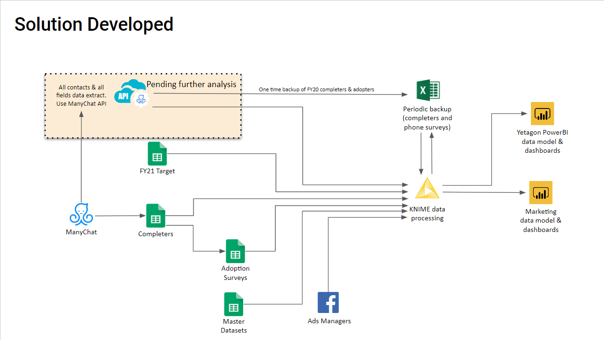
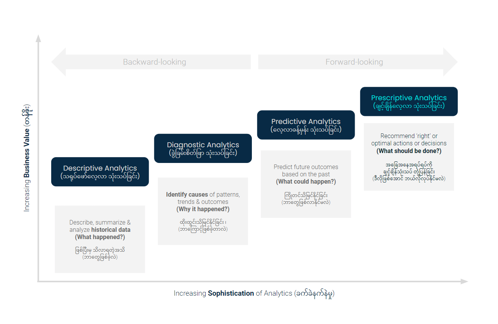
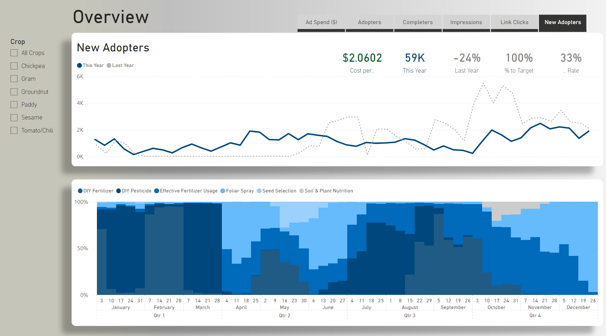
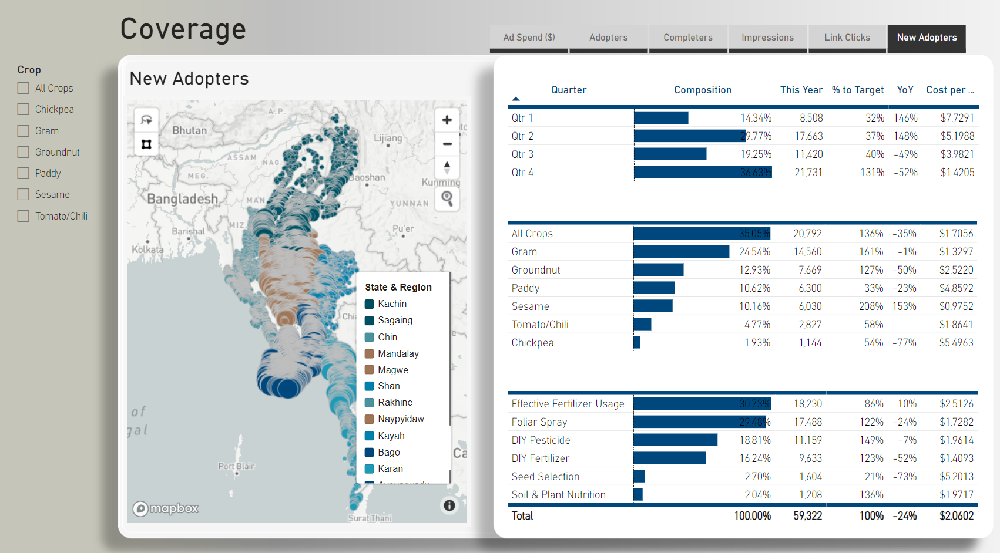
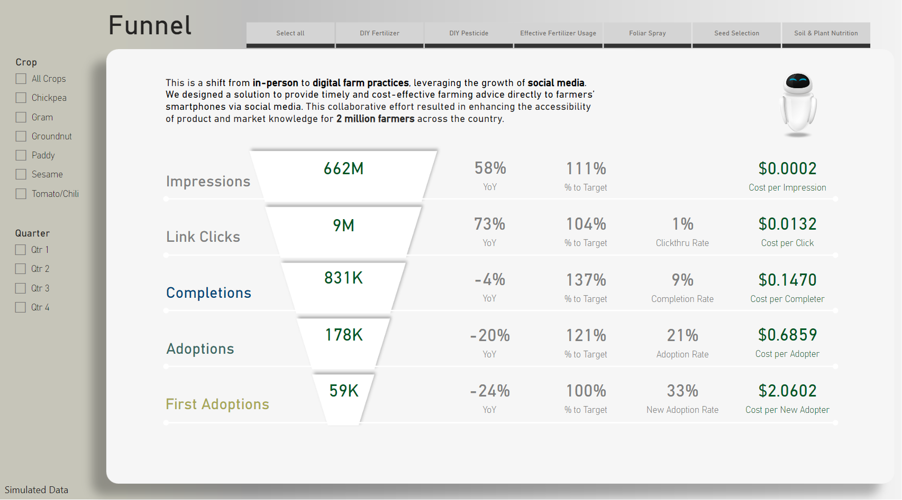

# Background

The twin shocks of the COVID-19 pandemic in 2020 and the Myanmar coup in early 2021 forced a suspension of in-person agricultural advisory services and drove up the cost of commercial fertilizers and pesticides. I saw this as an opportunity to shift from in-person to digital farm practices, leveraging the growth of social media. I pitched the idea to senior management. When it was accepted, I immersed myself with the Digital Marketing, Contact Center, Product & Service Design, Agronomy, and Digital Initiative to integrate ideas and domain knowledge from these diverse teams to design and provide timely and cost-effective farming advice directly to farmers’ smartphones. We pivoted to digital campaigns on Facebook and Facebook Messenger to promote lower cost, accessible, and sustainable homemade organic inputs. To date, Tthis collaborative effort resulted in enhancing the accessibility of sustainable farming practices, weather and market information for 2 million farmers.[(Read More About THIS)](https://bit.ly/3LUldK4)




> The project aims to create a comprehensive data ecosystem for this solution AgronomyBot, which includes developing ETL workflows, a data repository, a dashboard, and SOPs for maintaining the workflow and dashboard. As part of the project, an audit of the existing data structure will be conducted, and a new template will be recommended to integrate data from multiple sources. The ideal outcome of this project is to meets Organization Objective on Develop strong data-driven business decision making culture and systems that can contribite to Organization Mission and Strategies.  


# Project Deliverables
- Project charter [(See More)](https://bit.ly/43OcuA1)
- ETL workflow 
- Data defination [(See More)](https://bit.ly/3n9NKSo)
- Wireframe
- Dashboard [(See More)](https://bit.ly/3nZEyjK)
- SOP 
- User training
- Meeting notes 

### Analytical Approach




# Target Setting


> Combine Siloed Data with Production Data: At the start of this Customer Experience Center, the team used Google Sheets to capture information since the operation was in its early stages. Later on, with support from a centralized Business Intelligence and Data Analytics team, they designed and developed a comprehensive data ecosystem and reporting system. However, Google Sheets continued to be used initially to manage information before Digital Initiative team implement a digital twin of their operation


> Infobip to KNIME: Infobip is a leading provider of omnichannel communication, contact center, chatbot, customer engagement, and customer data platforms. Leveraging this cutting-edge technology, we share farming practice content with farmers via Viber on their smartphones. To ensure data safety and security, we transfer the data using SFTP, as recommended by Infobip. Then, we fetch this data and use it in our ETL pipeline for reporting purposes


> Messenger LiveChat & Google Sheet Integration: ManyChat is a vital component of our digital agronomy solution as it enables us to disseminate farming advice to farmers and receive their direct inquiries via messenger. The platform's built-in integration facilitates the capture of chat flow and live chat data, which is then transmitted directly to Google Sheets. The Digital Marketing team established this integration during the early stages of development, while the Data team is responsible for managing and architecting this data to derive valuable insights from it. Although we plan to upgrade to a more advanced data storage solution, such as a Snowflake Cloud Data Warehouse, the current ETL pipeline represents our current workflow.


> JSON from Viber Community: We have launched a digital farming practices community in Myanmar by utilizing the widespread coverage of Viber users. Through these communities, we educate farmers on the best practices to manage their farms, land, crops, pests & diseases, and yield. Viber serves as our platform to achieve these goals and connect with farmers.  The platform allows us to export JSON files, which contain daily-level-aggregated data that highlights the status of the community. The digital marketing team is responsible for launching new farming practices, educating, engaging, and maintaining these communities. They regularly download these JSON files and reached out our team (Data Analytics team) for leveraging the power of data and analytics to gain insights into community performance.

# Data modelling
I use pre-aggregated data for this portfolio project. It helps me reduce the amount of data and sensitive information that needs to be processed for analyses or reporting. It involves summarizing or grouping data at a higher level of granularity, such as by week or month, instead of processing every individual record. I use THREE pre-aggregation methods:

Summarizing data by time intervals (daily basics)
Aggregating data by categories (less granularity in dimension data)
Filtering data to exclude irrelevant records (omit sensitive information)

[](./Diagrams/1_Data_Model.png)

### DAX used in this SAMPLE Dashboard [(See More)](https://bit.ly/3n9NKSo)

```
# of Inquiry (Hotline) =
CALCULATE (
    SUM ( 'Inquiry Data [Hotline]'[# of Inquiry] )
)
```
```
# of Inquiry LY (Hotline) = 
CALCULATE(
    [# of Inquiry (Hotline)],
    SAMEPERIODLASTYEAR ( 'Master Data [Business Calendar]'[Date]))
```
```
# of Inquiry Solved (Hotline) =
CALCULATE (
    SUM ( 'Inquiry Data [Social Media]'[# of Inquiry] ),
    'Inquiry Data [Social Media]'[Status] = "Solved"
)
```
```
# of Inquiry (All Channels) = 
VAR Hotline = [# of Inquiry (Hotline)]
VAR SocialMedia = [# of Inquiry (Social Media)]

RETURN 
CALCULATE(Hotline + SocialMedia)
```

### Batch Script
```
C:\"Program Files"\KNIME\knime.exe -consoleLog -nosplash -application org.knime.product.KNIME_BATCH_APPLICATION -workflowFile=A:\Knime-workflow\automatedscripts\Name_of_Workflow.knwf -reset -nosave

if %errorlevel% == 0 (
goto :message0)
if %errorlevel% == 2 (
goto :message2)
if %errorlevel% == 3 (
goto :message3)
if %errorlevel% == 4 (
goto :message4)

:message0
@echo off
cls
echo ========= Workflow completed successfully ===========
pause
exit

:message2
@echo off
cls
echo ======== Parameters are wrong or missing ===========
pause
exit

:message3
@echo off
cls
echo ========= Errors occurs during loading the workflow ===========
pause
exit

:message4
@echo off
cls
echo ========= Workflow did not complete successfully =========== 
pause
exit
```
# Dashboard [(See More)](https://bit.ly/3nZEyjK)

> This comprehensive overview tab offers valuable insights into the seasonal trends of farming practices, empowering users to effortlessly switch between key metrics. This functionality enables the flexibility to adapt and optimize chat flow and digital campaign strategies, ensuring effective customer reach and engagement.


> Within this tab, you will find a comprehensive and detailed analysis of the geographical coverage achieved by our campaign across the entire country. This section also presents an insightful examination of the various types of crops and farming practices that our customers have actively engaged in. It offers a deep and thorough exploration of the performance and effectiveness of AgronomyBot in addressing the challenges faced by farmers. These proactive measures aim to mitigate the occurrence of farming disasters and promote sustainable agricultural practices.


> This dashboard section delves into the customer journey (or) funnel, with a specific emphasis on key metrics that provide a deeper understanding of the customer journey, operational efficiency, OPEX, and enables the team to make informed decisions during campaign periods. Moreover, leveraging this knowledge allows us to run prescriptive analysis for setting campaign targets in the upcoming fiscal year.