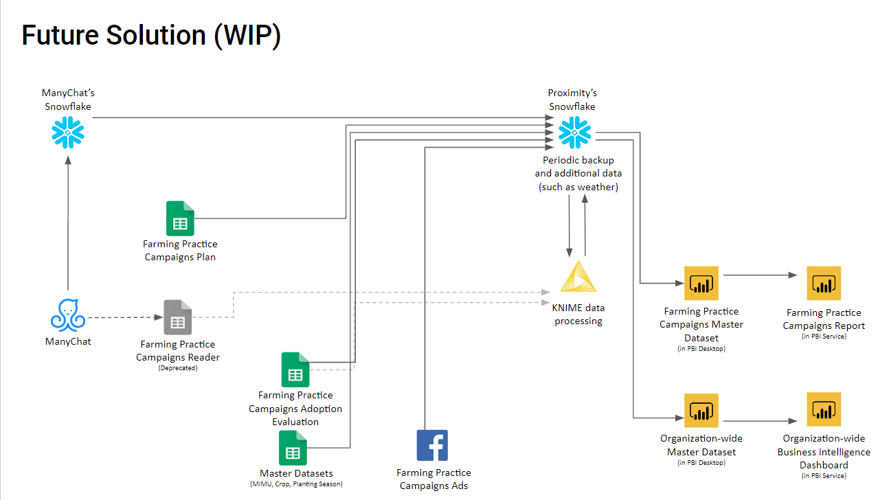
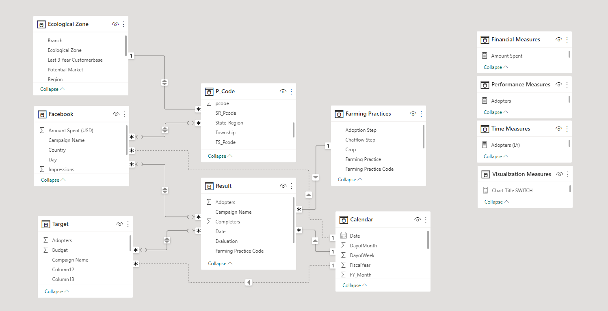

# Background

The twin shocks of the COVID-19 pandemic in 2020 and the Myanmar coup in early 2021 forced a suspension of in-person agricultural advisory services and drove up the cost of commercial fertilizers and pesticides. I saw this as an opportunity to shift from in-person to digital farm practices, leveraging the growth of social media. I pitched the idea to senior management. When it was accepted, I immersed myself with the Digital Marketing, Contact Center, Product & Service Design, Agronomy, and Digital Initiative to integrate ideas and domain knowledge from these diverse teams to design and provide timely and cost-effective farming advice directly to farmers’ smartphones. We pivoted to digital campaigns on Facebook and Facebook Messenger to promote lower cost, accessible, and sustainable homemade organic inputs. To date, Tthis collaborative effort resulted in enhancing the accessibility of sustainable farming practices, weather and market information for 2 million farmers. This project also granted me opportunities to utilize my expertise to harness data and analytics with new farming technologies as proactive measures to stem the tide of farming disasters. Watching the impacts of farmers having access to this information, improving their crop quality and yields, motivates my teammates and me. Most importantly, it demonstrates how collective actions are helping to build a more vital agriculture industry - one farmer at a time.
[(Read More About THIS)](https://bit.ly/3LUldK4)


> The project aims to create a comprehensive data ecosystem for this solution AgronomyBot, which includes developing ETL workflows, a data repository, a dashboard, and SOPs for maintaining the workflow and dashboard. As part of the project, an audit of the existing data structure will be conducted, and a new template will be recommended to integrate data from multiple sources. The ideal outcome of this project is to meets Organization Objective on Develop strong data-driven business decision making culture and systems that can contribite to Organization Mission and Strategies.  




# Project Deliverables
- Project charter [(See More)](https://bit.ly/43OcuA1)
- ETL workflow 
- Data defination [(See More)](https://bit.ly/3n9NKSo)
- Wireframe
- Dashboard [(See More)](https://bit.ly/3nZEyjK)
- SOP 
- User training
- Meeting notes 

### Analytical Approach


# Target Setting


> "Setting campaign targets can be a complex task, considering various factors such as crops, seasonality, region, precipitation, and soil health. However, we strive to overcome these challenges by leveraging our analysis of historical data to establish reference rates. This enables us to identify and celebrate specific farming practices at the optimal timing, ultimately delivering smartphones to farmers in a smart and efficient manner."

# Data modelling
I use pre-aggregated data for this portfolio project. It helps me reduce the amount of data and sensitive information that needs to be processed for analyses or reporting. It involves summarizing or grouping data at a higher level of granularity, such as by week or month, instead of processing every individual record. I use THREE pre-aggregation methods:

- Summarizing data by time intervals (daily basics)
- Aggregating data by categories (less granularity in dimension data)
- Filtering data to exclude irrelevant records (omit sensitive information)
- Simulating data based to display similar trends and patterns (not actual figures)




### DAX used in this SAMPLE Dashboard [(See More)](https://bit.ly/3n9NKSo)

```
Adopters (for Operation) = 
SUMX (
    Results,
    IF (
        Results[Week]
            < DATE ( 2020, 7, 1 ),
        -- Case 1: For FY20 results, use the reported adoption numbers (that are in the results table).
        Results[Adopters],
        IF (
            NOT (
                ISBLANK (
                    LOOKUPVALUE (
                        'Adoption evaluations'[Adoption rate],
                        'Adoption evaluations'[Evaluation], Results[Evaluation],
                        BLANK ()
                    )
                )
            ),
            -- Case 2: use the actual evaluation results for the adoption rate. Multiply with actual completers.
            Results[Completers]
                * LOOKUPVALUE (
                    'Adoption evaluations'[Adoption rate],
                    'Adoption evaluations'[Evaluation], Results[Evaluation],
                    BLANK ()
                ),
            -- Case 3: There is no adoption rate yet. Report blank results:
            BLANK ()
        )
    )
)

```
```
Adopters (for Reporting) = 
VAR _dates =
    VALUES ( 'Calendar'[date] )
RETURN
    SUMX (
        CALCULATETABLE (
            Results,
            REMOVEFILTERS ( 'Calendar' )
        ),
        IF (
            Results[Source table] = "FY20 results",
            -- Case 1: FY20 results, just report them at the date of the results entry
            IF (
                Results[Week]
                    IN _dates,
                Results[Adopters],
                BLANK ()
            ),
            -- Case 2: FY21+ results, we need to filter to the adoption month dates
            IF (
                -- Step 2.A: Filter to the adoption month:
                LOOKUPVALUE (
                    'Adoption evaluations'[Adoption month],
                    'Adoption evaluations'[Evaluation], Results[Evaluation],
                    BLANK ()
                )
                    IN _dates,
                -- Step 2.B: lookup the adoption rate and multiply with completers
                Results[Completers]
                    * LOOKUPVALUE (
                        'Adoption evaluations'[Adoption rate],
                        'Adoption evaluations'[Evaluation], Results[Evaluation],
                        BLANK ()
                    ),
                -- If the adoption month is blank or does not fall in the _dates period, then don't count adopters:
                BLANK ()
            )
        )
    )

```
```
Adopters forecast = 
-- Forecasts adoptions based on Evaluation Results IF they exist, and on Target Adoption Rates if not.
VAR _targetAdoptionRate =
    CALCULATE (
        [Adoption rate target],
        ALL ( 'Target completers' )
    )
RETURN
    -- For adopters before the cut-off date, use the results table:
    SUMX (
        Results,
        IF (
            Results[Week]
                < DATE ( 2020, 7, 1 ),
            -- Case 1: For FY20 results, use the reported adoption numbers (that are in the results table).
            Results[Adopters],
            IF (
                Results[Week]
                    < DATE ( 2020, 11, 1 ),
                IF (
                    NOT (
                        ISBLANK (
                            LOOKUPVALUE (
                                'Adoption evaluations'[Adoption rate],
                                'Adoption evaluations'[Evaluation], Results[Evaluation],
                                BLANK ()
                            )
                        )
                    ),
                    -- Case 2: use the actual evaluation results for the adoption rate. Multiply with actual completers.
                    Results[Completers]
                        * LOOKUPVALUE (
                            'Adoption evaluations'[Adoption rate],
                            'Adoption evaluations'[Evaluation], Results[Evaluation],
                            BLANK ()
                        ),
                    -- Case 3: use an estimate for the adoption rate (the target). Multiply with actual completers.
                    Results[Completers] * _targetAdoptionRate
                ),
                BLANK ()
            )
        )
    )
        + -- For adopters after the cut-off date, use the copmletions table:
        SUMX (
            VALUES ( 'Technique Dates'[Evaluation] ),
            CALCULATE (
                DISTINCTCOUNT ( Completions[User ID] ),
                Completions[Completion date as date]
                    >= DATE ( 2020, 11, 1 )
            )
                * IF (
                    NOT (
                        ISBLANK (
                            LOOKUPVALUE (
                                'Adoption evaluations'[Adoption rate],
                                'Adoption evaluations'[Evaluation], 'Technique Dates'[Evaluation],
                                BLANK ()
                            )
                        )
                    ),
                    LOOKUPVALUE (
                        'Adoption evaluations'[Adoption rate],
                        'Adoption evaluations'[Evaluation], 'Technique Dates'[Evaluation],
                        BLANK ()
                    ),
                    _targetAdoptionRate
                )
        )

```
```
Completers (for Operation) = 

-- Part 1: FY20 Reported Completers
CALCULATE(
    sum(Results[Completers]),
    filter( Results, Results[Source table] = "FY20 results" )
) +

-- Part 2: FY21 Reported Completers
CALCULATE(
    sum(Results[Completers]),
    filter( 
        Results, 
        -- Need to apply date filter here instead of source table filter. 
        -- This is due to completers in the FY21 source table that are listed 
        -- with a FY20 completion date but are counted towards FY21 adopters results.
        Results[Week] <  DATE(2020, 11, 1) && Results[Week] >= DATE(2020, 7, 1)
    )
) +

-- Part 3: Completers from completer timestamps data
CALCULATE(
    DISTINCTCOUNT( Completions[User ID] ),
    filter(Completions, Completions[Completion date] >= DATE(2020, 11, 1))
)
```

### Batch Script
```
C:\"Program Files"\KNIME\knime.exe -consoleLog -nosplash -application org.knime.product.KNIME_BATCH_APPLICATION -workflowFile=A:\Knime-workflow\automatedscripts\Name_of_Workflow.knwf -reset -nosave

if %errorlevel% == 0 (
goto :message0)
if %errorlevel% == 2 (
goto :message2)
if %errorlevel% == 3 (
goto :message3)
if %errorlevel% == 4 (
goto :message4)

:message0
@echo off
cls
echo ========= Workflow completed successfully ===========
pause
exit

:message2
@echo off
cls
echo ======== Parameters are wrong or missing ===========
pause
exit

:message3
@echo off
cls
echo ========= Errors occurs during loading the workflow ===========
pause
exit

:message4
@echo off
cls
echo ========= Workflow did not complete successfully =========== 
pause
exit
```
# Dashboard [(See More)](https://bit.ly/3nZEyjK)

> This comprehensive overview tab offers valuable insights into the seasonal trends of farming practices, empowering users to effortlessly switch between key metrics. This functionality enables the flexibility to adapt and optimize chat flow and digital campaign strategies, ensuring effective customer reach and engagement.


> Within this tab, you will find a comprehensive and detailed analysis of the geographical coverage achieved by our campaign across the entire country. This section also presents an insightful examination of the various types of crops and farming practices that our customers have actively engaged in. It offers a deep and thorough exploration of the performance and effectiveness of AgronomyBot in addressing the challenges faced by farmers. These proactive measures aim to mitigate the occurrence of farming disasters and promote sustainable agricultural practices.


> This dashboard section delves into the customer journey (or) funnel, with a specific emphasis on key metrics that provide a deeper understanding of the customer journey, operational efficiency, OPEX, and enables the team to make informed decisions during campaign periods. Moreover, leveraging this knowledge allows us to run prescriptive analysis for setting campaign targets in the upcoming fiscal year.
